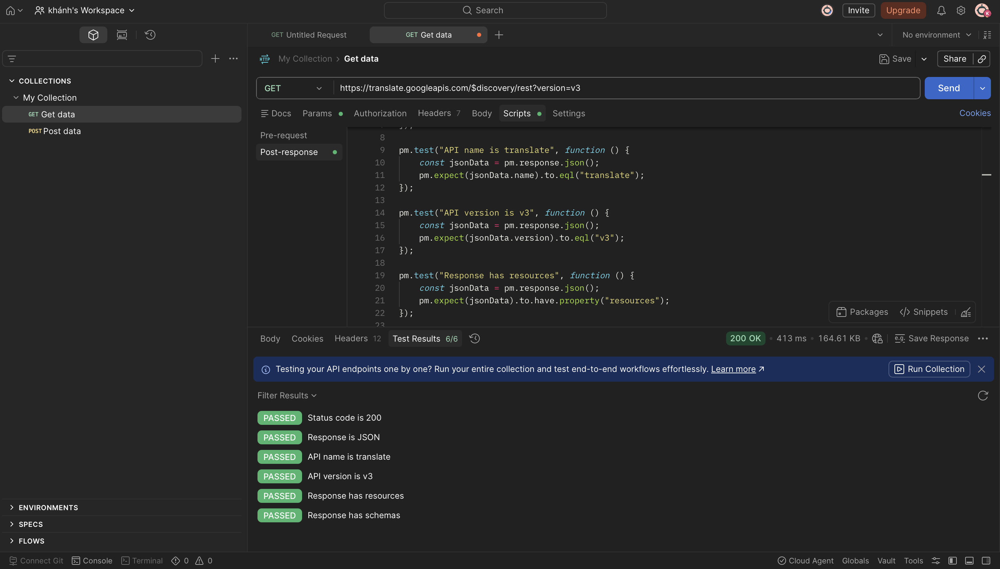

# Báo cáo kiểm thử API Google Translate Discovery bằng Postman

## 1. Thông tin sinh viên

* Họ và tên: Nguyễn Nam Khánh
* Mã sinh viên: 23010771
* Lớp: KTPM_EL2
* Môn học: Kiểm thử phần mềm
* Công cụ sử dụng: Postman
* Link GitHub Repository: https://github.com/khanhdat1

---

## 2. Mục tiêu bài thực hành

Bài thực hành nhằm tìm hiểu và sử dụng công cụ Postman để kiểm thử API. Trong bài này, em thực hiện kiểm thử endpoint Discovery Document của Google Translate API v3.

API được kiểm thử:

```text
https://translate.googleapis.com/$discovery/rest?version=v3
```

Đây là API dùng để lấy tài liệu mô tả cấu trúc của Google Translate REST API v3. Kết quả trả về là dữ liệu JSON chứa thông tin như tên API, phiên bản API, danh sách tài nguyên và schema.

---

## 3. Công cụ và môi trường thực hiện

| Thành phần               | Nội dung                                |
| ------------------------ | --------------------------------------- |
| Công cụ kiểm thử         | Postman                                 |
| API kiểm thử             | Google Translate API Discovery Document |
| Phương thức HTTP         | GET                                     |
| Định dạng dữ liệu trả về | JSON                                    |
| Trình quản lý mã nguồn   | GitHub                                  |

---

## 4. Tạo Collection trong Postman

Em tạo một Collection trong Postman để quản lý request kiểm thử.

Tên Collection:

```text
My Collection
```

Request đã thực hiện:

```text
GET Get data
```

Sau khi hoàn thành, request này được dùng để kiểm thử API Discovery Document của Google Translate API v3.

---

## 5. Chi tiết API được kiểm thử

### 5.1. Request

| Thành phần    | Nội dung                                                      |
| ------------- | ------------------------------------------------------------- |
| Method        | GET                                                           |
| URL           | `https://translate.googleapis.com/$discovery/rest?version=v3` |
| Authorization | Không yêu cầu                                                 |
| Body          | Không có                                                      |

---

### 5.2. Mục đích kiểm thử

Mục đích của request này là kiểm tra xem API Discovery Document của Google Translate API v3 có hoạt động đúng hay không.

Các nội dung cần kiểm tra gồm:

* API trả về status code `200 OK`.
* Response trả về đúng định dạng JSON.
* Response có tên API là `translate`.
* Response có phiên bản API là `v3`.
* Response có trường `resources`.
* Response có trường `schemas`.

---

## 6. Test Script trong Postman

Trong tab **Scripts** của Postman, em viết các đoạn kiểm thử tự động ở phần **Post-response** như sau:

```javascript
pm.test("Status code is 200", function () {
    pm.response.to.have.status(200);
});

pm.test("Response is JSON", function () {
    pm.response.to.be.json;
});

pm.test("API name is translate", function () {
    const jsonData = pm.response.json();
    pm.expect(jsonData.name).to.eql("translate");
});

pm.test("API version is v3", function () {
    const jsonData = pm.response.json();
    pm.expect(jsonData.version).to.eql("v3");
});

pm.test("Response has resources", function () {
    const jsonData = pm.response.json();
    pm.expect(jsonData).to.have.property("resources");
});

pm.test("Response has schemas", function () {
    const jsonData = pm.response.json();
    pm.expect(jsonData).to.have.property("schemas");
});
```

---

## 7. Kết quả kiểm thử

Sau khi bấm **Send**, Postman trả về kết quả thành công.

| Tiêu chí kiểm thử      | Kết quả |
| ---------------------- | ------- |
| Status code is 200     | Passed  |
| Response is JSON       | Passed  |
| API name is translate  | Passed  |
| API version is v3      | Passed  |
| Response has resources | Passed  |
| Response has schemas   | Passed  |

Tổng số test case tự động:

```text
6/6 Passed
```

Status code trả về:

```text
200 OK
```

Thời gian phản hồi:

```text
413 ms
```

Dung lượng phản hồi:

```text
164.61 KB
```

---

## 8. Hình ảnh minh họa kết quả thực hiện

### 8.1. Kết quả kiểm thử API trên Postman

Ảnh dưới đây minh họa request GET đến Google Translate Discovery API và kết quả kiểm thử tự động trong Postman.



---

## 9. Cấu trúc Repository

Repository GitHub được tổ chức như sau:

```text
postman-google-translate-api-testing/
│
├── README.md
├── google-translate-api-testing.postman_collection.json
└── images/
    └── 01-discovery-test-pass.png
```

Trong đó:

* `README.md`: file báo cáo bài thực hành.
* `google-translate-api-testing.postman_collection.json`: file Collection được export từ Postman.
* `images/`: thư mục chứa hình ảnh minh họa kết quả kiểm thử.

---

## 10. Nhận xét

Qua bài thực hành này, em đã biết cách sử dụng Postman để gửi request API, kiểm tra response trả về và viết test script tự động. Postman giúp quá trình kiểm thử API trở nên trực quan, dễ theo dõi và dễ lưu lại kết quả.

Việc kiểm thử Google Translate Discovery API giúp em hiểu cách kiểm tra một API đơn giản với phương thức GET, đồng thời biết cách xác minh các thông tin quan trọng trong response như status code, định dạng JSON, tên API, phiên bản API và các trường dữ liệu cần thiết.

---

## 11. Kết luận

Bài thực hành đã hoàn thành việc kiểm thử endpoint Discovery Document của Google Translate API v3 bằng Postman. Kết quả cho thấy API hoạt động đúng, trả về status code `200 OK`, response đúng định dạng JSON và toàn bộ 6 test case tự động đều Passed.

Thông qua bài này, em đã nắm được quy trình cơ bản khi kiểm thử API bằng Postman, bao gồm tạo request, gửi request, kiểm tra response, viết test script và lưu kết quả để báo cáo trên GitHub.
